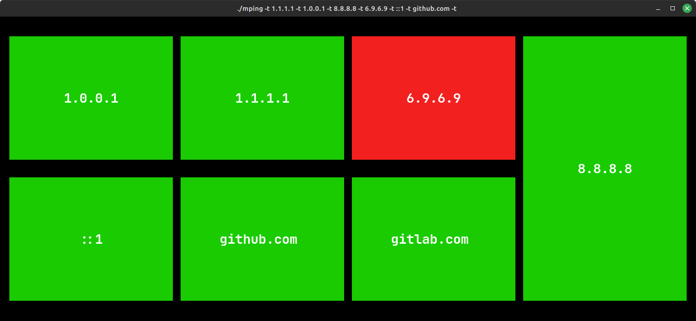

# Ping'T

*A TUI application graphically visualizing the ping status of a target*

This application acts as a wrapper for `fping`.
This means all target formats accepted by your installed `fping` binary should also be accepted by this tool.

## Installation

First install the `fping` program per instruction of your operating system. 
For systems using apt `apt install fping` should suffice.

Then either build the program yourself as instructed bellow or download it from the [releases](https://github.com/FKD13/PingTUI/releases) page.
Place the binary in a location that is included in your PATH.

## Building

```bash
go build -o pingt -ldflags="-s -w" .
```